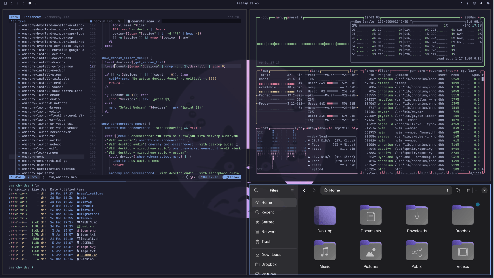

# Mochajuice

A Catppuccin Mocha-based theme for [Omarchy](https://omarchy.org/), with rounded window corners and a tmux-style pill Waybar layout — applied automatically while the theme is active.

## Preview



## Install

```bash
omarchy-theme-install https://github.com/rutger1140/omarchy-mochajuice-theme
```

This clones the theme into `~/.config/omarchy/themes/mochajuice` and activates it. Switching away (`omarchy-theme-set <other>`) reverts everything cleanly.

## What's included

- `colors.toml` — Catppuccin Mocha palette
- `backgrounds/` — wallpapers
- `btop.theme`, `icons.theme`, `neovim.lua`, `vscode.json` — per-app theming
- `hyprland.conf` — accent border color + `rounding = 8` for soft window corners. Sourced by `~/.config/hypr/hyprland.conf`.
- `waybar.css` — three-pill Waybar layout (blue / mauve / peach on a transparent bar). `@import`-ed by `~/.config/waybar/style.css`; selectors prefixed with `window#waybar` to win specificity over the stock rules.

## Credit

Color palette: [Catppuccin Mocha](https://github.com/catppuccin/catppuccin).
